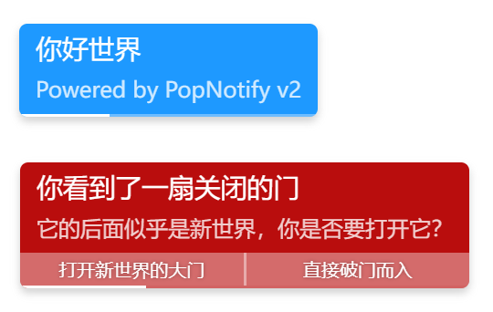

# PopNotify.js
一个简单的通知条js，练手项目。



## 引入
```html
<link rel="stylesheet" href="PopNotify.css">
<script src="PopNotify.js"></script>
```

## 生成一条通知
```js
popNotify.notify("Hello~", "Click to close!", 5000);
```

1.1版本后，还可以使用：
```js
popNotify.show("Hello","world","info");
```

> 添加 `popNotify.show()` 方法是因为原 `popNotify.notify()` 的参数顺序不合理，但是为了不破坏已经这样调用的程序，添加了新的方法。
> `show()`与`notify()`除了参数顺序以外，还把超时的单位由毫秒改为了秒，除了这两点以外`show()`与`notify()`完全一致。

1.2重构版本后，还可以使用：
```js
popNotifyUnit.create({
 style:"info",
 title:"Hello",
 content:"world",
 register:true
}).show();
```

> 使用此种方式为先创建通知项目随后再添加到队列的方式，并且支持对象传入以避免被参数顺序影响使用。

### 参数解释
```js
popNotify.notify(title, content, timeout, onclick, style)
popNotify.show(title, content, style, timeout, onclick)
popNotify.info(title, content, timeout, onclick)
popNotify.warn(title, content, timeout, onclick)
popNotify.error(title, content, timeout, onclick)
popNotify.success(title, content, timeout, onclick)
```
* **title:** 通知标题，设为`null`来跳过标题。
  * 设置为`null`时不会为标题留空，如果需要留空，请设为`""`。
* **content:** 通知内容，设为`null`来跳过内容。
  * 设置为`null`时不会为内容留空，如果需要留空，请设为`""`。
* **timeout:** 超时，通知要显示多少秒 (在`popNotify.notify()`中单位是毫秒)。
  * 不设置或`null`值时，默认显示5秒。
* **onclick:** 点击回调，当通知被点击时执行。
  * 回调的第一个参数是事件，第二个参数是对应实例，回调返回`true`时关闭通知，否则通知会等待超时才会关闭。
  * 如果参数不是可执行的对象则被忽略。
  * 设置回调后需要自己添加除超时以外的关闭方式，默认的点击关闭功能会被覆盖。
* **style:** 预设样式名称。
  * 默认预设有`null`(黑白)、`info`、`success`、`warn`、`error`四种。
  * 可以添加样式表来扩展这里可以填写的值，未知的样式默认使用黑白样式。
 
## 样式
已经默认预设了四种样式，并且可以自行添加。

假如新的样式名为`new`，则添加样式表：

```css
.popStyle-new {
    background: rgb(255, 196, 196) !important; /* 通知背景颜色 */
}

.popStyle-new .popNotifyUnitTitle,
.popStyle-new .popNotifyUnitContent {
    color: rgb(255, 66, 66) !important; /* 通知文字颜色 */
}

/* 1.1版本新增的进度条 */
.popStyle-new .popNotifyUnitBar{
    background: rgb(255, 66, 66) !important; /* 进度条颜色，设置为透明来隐藏 */
}
```
之后便可使用`new`的名字调用这些样式。

## 查找和关闭通知
如果需要，可以通过通知返回的ID或通知的任意部分DOM来获得对应通知的实例。
```js
popNotify.getObjById(String id) : null || popNotifyUnit
popNotify.getObjByElement(HTMLElement e) : null || popNotifyUnit
```
获得实例后执行实例下的`.destory()`方法即可正常关闭对应通知，或设置参数为`true`以无动画的方式立刻删除通知。

您也可以直接通过一个代理的方法直接关闭对应通知，并且同时支持以上两种参数：
```js
popNotify.close(String id || HTMLElement e)
```

或者，想要直接关闭所有的通知：
```js
popNotify.closeAll()
```

## 通知控制与重新打开

在1.2版本后，允许对通知进行重新打开(重新打开仅支持默认队列)。
```js
// 获得通知项目：
let unit = popNotify.info('title','content');
// 或
popNotifyUnit.create({
 style:"info",
 title:"Hello",
 content:"world",
 register:true
}).show();

// 当通知显示已结束后重新打开：
unit.show();
// 或
unit.replay("success","title","content");
// 或
unit.replay({style:"success",title:"title",content:"content"});

// 随时设置标题、内容与样式
unit.setStyle('error');
unit.setTitle('错误');
unit.setContent('出现了一个错误');

// 修改超时模式
unit.setTimer(5000);

// 手动进度条
let progress = unit.setProgress(/* 0, 100, true */);
progress.setAutoClose(false);
progress.set(50);
progress.step(10);
progress.calcProgress(100,1000);
progress.done();

// 切换回超时模式
unit.setTimer();
```
